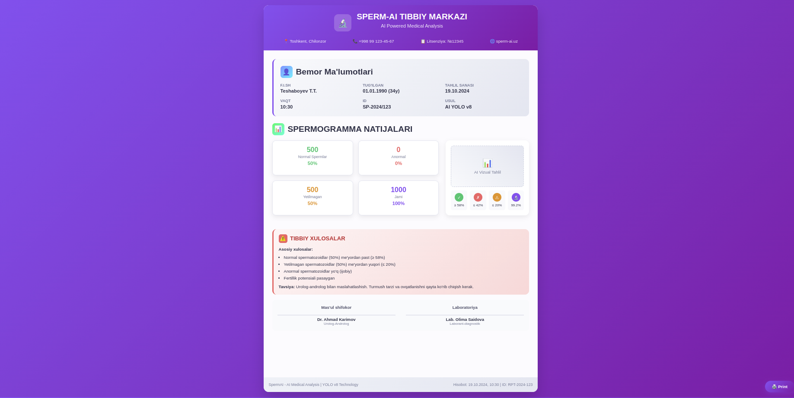

# SpermAI: AI-based Automated Sperm Morphology and Viability Analysis

SpermAI is an intelligent web-based medical analysis platform that leverages deep learning (YOLOv8-based) object detection and classification techniques for automated sperm cell detection, morphological evaluation, and viability assessment from microscope images.

This system is designed for clinical laboratories and fertility clinics, offering rapid, reproducible, and standardized spermogram reports.

---

## 🧪 Key Functionalities

- **Microscopic Image Analysis**  
  Automatic detection of sperm cells from uploaded microscope images using a trained YOLOv8 detection model.

- **Cell Classification**  
  Each detected sperm cell is classified into `Normal`, `Abnormal`, or `Other` based on morphology using a secondary classification model.

- **Viability Estimation**  
  Differentiates sperm into `Live`, `Dead`, and `Immature` categories.

- **Interactive Interface**  
  Modern, user-friendly frontend with real-time visual results, summary statistics, and labeled cropped images.

- **Report Generation**  
  Automatically generates a printable PDF report that includes morphological breakdown, viability analysis, and clinical interpretation based on WHO standards.

---

## 🖼 Interface Previews

### Analysis Interface


### Auto-Generated Report



---

## 📁 Project Structure

```

sperm-ai/
├── app.py                 # Entry point (Flask)
├── Dockerfile             # Docker build file
├── requirements.txt       # Python dependencies
├── configs/
│   └── config.yaml        # System configuration
├── models/                # Trained YOLOv8 detection & classification models
├── logs/                  # Application logs
├── static/                # Static assets (uploads, CSS, JS)
│   └── uploads/
├── templates/             # Jinja2 HTML templates
├── tests/                 # Pytest unit tests
├── src/                   # Application source code
│   ├── api/               # Flask route handlers
│   ├── models/            # YOLOv8 detection/classification logic
│   └── utils/             # Image processing, logging

````

---

## ⚙️ Configuration

Configuration is managed via `configs/config.yaml`:

```yaml
server:
  host: 0.0.0.0
  port: 5000
  debug: true

models:
  detection: models/best.pt
  classification: models/cls_model.pt

paths:
  upload_folder: static/uploads
  log_folder: logs

logging:
  level: INFO
  max_size: 10485760
  backup_count: 5
````

---

## 🚀 Setup Instructions

### 1. Clone Repository

```bash
git clone https://github.com/yourname/sperm-ai.git
cd sperm-ai
```

### 2. Install Dependencies

```bash
pip install -r requirements.txt
```

### 3. Download & Place Models

Place your trained YOLOv8 detection (`best.pt`) and classification (`cls_model.pt`) files into the `models/` directory.

### 4. Run Application

```bash
python app.py
```

Open your browser: [http://localhost:5000](http://localhost:5000)

---

## 🐳 Docker Support

### Build Image

```bash
docker build -t sperm-ai .
```

### Run Container

```bash
docker run -p 5000:5000 \
  -v $(pwd)/models:/app/models \
  -v $(pwd)/logs:/app/logs \
  -v $(pwd)/static/uploads:/app/static/uploads \
  sperm-ai
```

---

## 🔬 API Endpoints

| Endpoint   | Method | Description                         |
| ---------- | ------ | ----------------------------------- |
| `/`        | GET    | Main UI                             |
| `/report`  | GET    | Analysis report preview             |
| `/analyze` | POST   | Upload and analyze microscope image |

**POST /analyze**

* **Input**: Form-data containing `file` (image)
* **Output**: JSON containing detection results, classification summary, and image crops

---

## ✅ Testing

Run unit tests with:

```bash
pytest tests/
```

---

## 📜 License

This project is released under the MIT License.

---

## 📧 Contact

* Author: \[Muhammadiyev Bahrombek]
* Email: [bahrombekmuhammadiyev@gmail.com](mailto:bahrombekmuhammadiyev@gmail.com)
* Website: [https://sperm-ai.uz](https://sperm-ai.uz)

---

